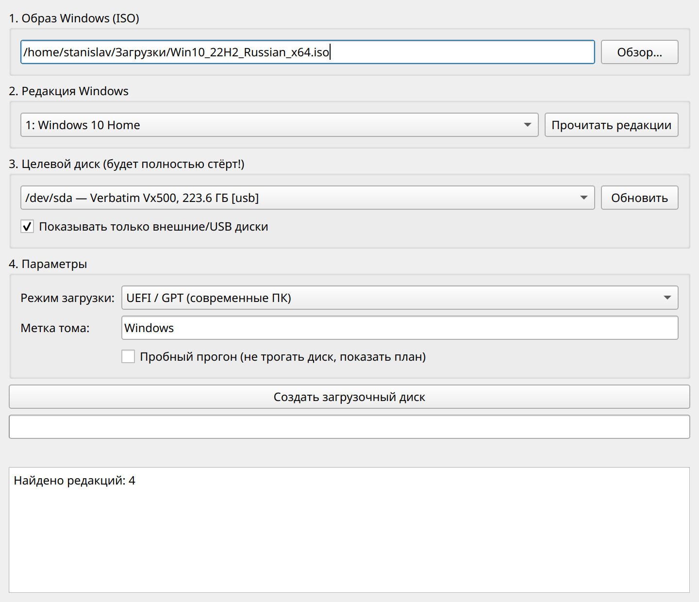
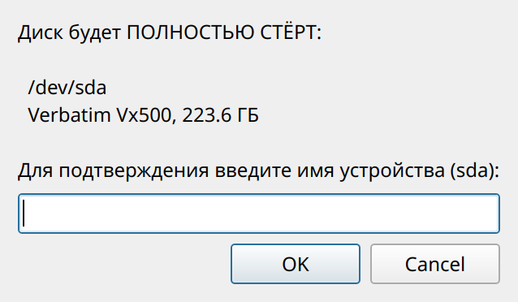
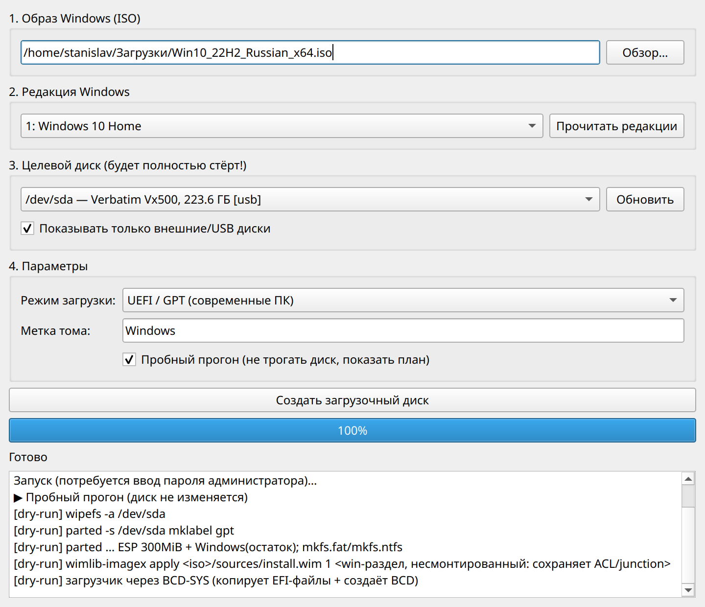

# WinToGo Creator

*Create a bootable "Windows To Go" external drive from Linux — a PyQt6 GUI
around wimlib and BCD-SYS. UI is in Russian.*

Графическое приложение (PyQt6) для Linux, которое разворачивает **Windows 10/11
из ISO на внешний USB-диск** так, чтобы система загружалась с него на реальном
железе — аналог Rufus «Windows To Go» / WinToUSB, которых под Linux нет.

Работает через нативные инструменты Linux: `wimlib` для применения образа,
`parted`/`mkfs` для разметки, **BCD-SYS** для создания загрузчика и BCD.
Установленная Windows — не виртуальная машина: диск загружается на настоящем
железе, как обычная установка.

> ✅ **Статус: v0.2.6 — проверено на реальном железе.** Полный конвейер
> (разметка GPT, форматирование, развёртывание образа, загрузчик + BCD)
> отработал на внешнем SSD: Windows 10 22H2 загрузилась с него по UEFI и
> штатно прошла установку (OOBE) без ошибок.



---

## Возможности

- Выбор ISO и **чтение списка редакций** (Home/Pro/…) прямо из образа.
- Список целевых дисков с **жёсткими предохранителями**:
  - системный диск (где `/`, `/boot`, `/boot/efi`) помечается ⛔ и запрещён к
    записи — проверка дублируется и в GUI, и в привилегированном ядре;
  - по умолчанию показываются только внешние/USB-диски;
  - подтверждение стирания требует **вручную ввести имя устройства**:

    
- Режимы **UEFI/GPT** (основной, проверен) и **BIOS/MBR** (экспериментальный).
- **Пробный прогон** (dry-run): показывает полный план команд, не трогая диск:

  
- Прогресс развёртывания и подробный лог.
- Повышение прав через **pkexec** (GUI работает без root; диск пишет отдельный
  привилегированный процесс).

## Зависимости

```bash
sudo apt install python3-pyqt6 wimtools gdisk dosfstools ntfs-3g \
                 pkexec udisks2 libhivex-bin libwin-hivex-perl attr fatattr xxd
```

| Пакет | Зачем |
|-------|-------|
| `python3-pyqt6` | графический интерфейс |
| `wimtools` | `wimlib-imagex` — применение install.wim/esd |
| `gdisk`, `dosfstools`, `ntfs-3g` | разметка и файловые системы |
| `pkexec` (полкит) | повышение прав из GUI |
| `udisks2` | монтирование ISO без root при чтении редакций |
| `libhivex-bin` (hivexsh), `libwin-hivex-perl` (hivexregedit), `attr`, `fatattr`, `xxd` | зависимости **BCD-SYS** (создание BCD) |
| `ms-sys` (опц.) | загрузочный сектор NTFS/MBR для BIOS-режима |

> `pev`/`peres`, который BCD-SYS требует на старте, на новых Ubuntu убран из
> репозитория. На свежем диске он не используется, поэтому приложение снимает
> это требование автоматически — устанавливать `pev` не нужно.

## Установка и запуск

Из каталога проекта:

```bash
python3 wintogo.py            # графическое окно
./install.sh                  # добавить ярлык в меню приложений
python3 wintogo.py --version
```

Либо собрать deb-пакет (поставит команду `wintogo`, ярлык и зависимости):

```bash
./packaging/build-deb.sh
sudo apt install ./build/wintogo-creator_*_all.deb
```

Порядок работы в окне: **1)** выбрать ISO → **2)** «Прочитать редакции» и
выбрать редакцию → **3)** выбрать внешний диск → **4)** параметры → «Создать
загрузочный диск». Рекомендуется сперва прогнать с галкой **«Пробный прогон»**.

> 💡 Выбирайте редакцию под свою лицензию: ключ от «Домашней» не активирует
> Pro, даже если образ один и тот же.

## Что делает под капотом (UEFI)

1. `parted` → GPT: раздел **ESP** (FAT32, 300 МБ) + раздел **Windows** (NTFS,
   остаток).
2. `mkfs.fat` / `mkfs.ntfs`.
3. `wimlib-imagex apply <install.wim> <индекс> <раздел>` — **на несмонтированный
   раздел** (режим NTFS-тома). Это принципиально: apply в смонтированный каталог
   теряет NTFS ACL и junction-точки, из-за чего установка Windows зацикливается
   на этапе OOBE («Разрешите Windows завершить настройку…»).
4. Установка загрузчика через **BCD-SYS** (см. ниже): копирование
   `Windows\Boot\EFI\*` (включая `bootmgfw.efi` и `\EFI\Boot\bootx64.efi`) на
   ESP и создание **BCD** (`\EFI\Microsoft\Boot\BCD`).

## Загрузчик и BCD (через BCD-SYS)

Windows не загрузится без корректного **BCD** (`\EFI\Microsoft\Boot\BCD`). На
Windows его создаёт `bcdboot`, которого под Linux нет — поэтому используется
встроенный **[BCD-SYS](https://github.com/jpz4085/BCD-SYS)** (`third_party/bcd-sys`):
bash-утилита, которая из Linux создаёт BCD через `hivex` (со своим встроенным
шаблоном Win10/11) и копирует загрузочные файлы, как `bcdboot`.

Приложение вызывает BCD-SYS с ключом `-s <ESP>`, поэтому он **не трогает
UEFI-меню хоста** и опирается на переносимый путь `\EFI\Boot\bootx64.efi` —
именно то, что нужно для внешнего диска. Созданный BCD дополнительно
проверяется как hive перед завершением. Если BCD-SYS недоступен (нет его
зависимостей), приложение переходит к **запасному способу**: копирует EFI-файлы
и пробует шаблон `assets/bcd/BCD`; если и это не вышло — выводит инструкцию и
помечает диск как «образ развёрнут, остался загрузчик».

**Запасной ручной путь** (если авто-BCD не отработал): загрузиться с
установочной флешки Windows, на первом экране нажать **Shift+F10** и выполнить
(где `W:` — раздел Windows этого диска, `S:` — его EFI-раздел):

```
bcdboot W:\Windows /s S: /f UEFI
```

## Частые вопросы

- **`[WARNING] Ignoring extended attributes of N files` при развёртывании** —
  безвредно: wimlib на ntfs-3g не переносит Windows EA
  (`$KERNEL.PURGE.ESBCACHE`), Windows пересоздаёт их при первой загрузке.
- **В образе нет «Documents and Settings», «Application Data»** — это нормально,
  Windows создаёт эти ссылки при первой загрузке.
- **Почему не обычный установщик Windows с флешки?** — установщик отказывается
  ставить систему на USB-диски, а его загрузчик пишется в первый попавшийся ESP
  и меняет NVRAM — есть риск задеть загрузку Linux на внутреннем диске. Здесь
  же затрагивается только выбранный внешний диск.

## Сторонние компоненты

- **BCD-SYS** © Joseph P. Zeller, лицензия **GPL-3.0**, вендорится в
  `third_party/bcd-sys` без изменений (со своим `LICENSE`) и вызывается как
  отдельная программа через `subprocess`. Это не делает WinToGo Creator
  производным произведением: наш код остаётся под MIT, BCD-SYS — под GPL-3.0.

## Ограничения и безопасность

- Приложение **перезаписывает выбранный диск целиком**. Всегда проверяйте выбор.
  Предохранители снижают риск, но окончательная ответственность — на пользователе.
- BIOS/MBR-режим экспериментальный (нужен `ms-sys` для загрузочного сектора NTFS).
- Split-WIM (`install.swm`) пока не поддерживается.
- Проверенная конфигурация: Windows 10 22H2 (install.esd), внешний SATA SSD в
  USB-боксе, загрузка UEFI.

## Лицензия

MIT — см. [LICENSE](LICENSE).
